como o projeto eh apenas o back-end, precisaremos instalar as bibliotecas do projeto e executa-lo do codigo fonte.
usando npm install voce instala todas as bibliotecas usadas
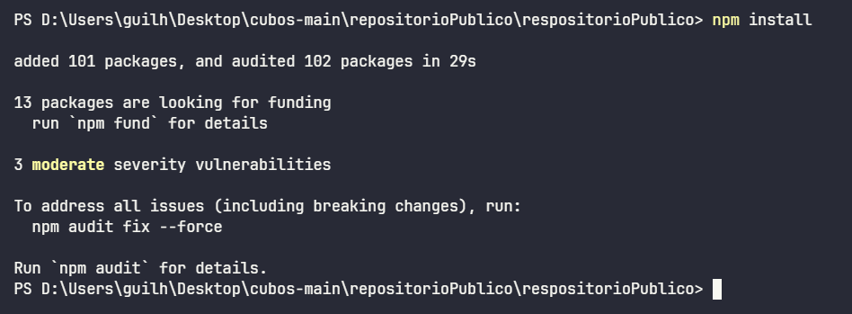
o primeiro endPoint eh o de listar contas do banco de dados:
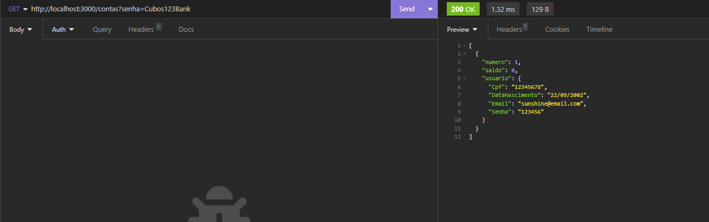
ele eh uma rota get que recebe como query params a senha do banco como se fosse de uma conta Adm e retorna todas as contas cadastradas.

o segundo parametro eh o de cadatrar contas:
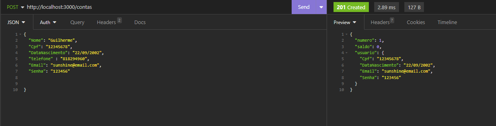
ele recebe nome, cpf, data de nascimento, telefone, email e senha no corpo da requisicao e verifica se existe algum outro cpf cadastrado, caso exista ele retorna um erro

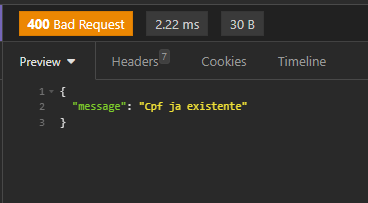

o terceiro parametro eh o de atualizar campos existentes
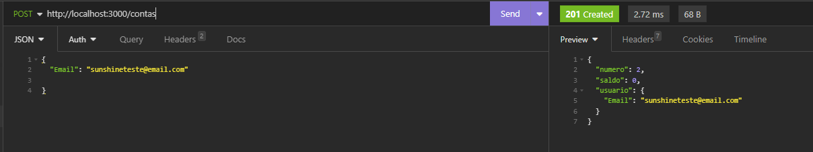 
nesse caso eu atualizei apenas o campo email, mas eh possivel atualizar qualquer campo existente. caso eu tente atualizar o campo email ou cpf e exista um outro email ou cpf identico ele retorna um erro

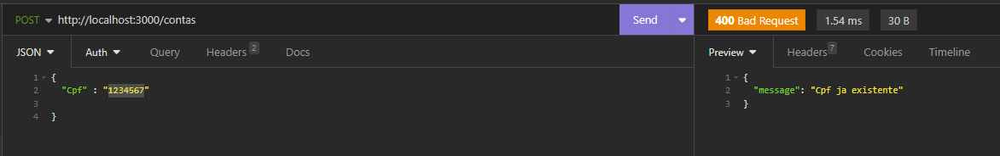

o quarto endPoint eh o de deletar conta, nesse endpoint ele pede como parametro o numero da conta, para poder identificar qual conta devera ser deletada
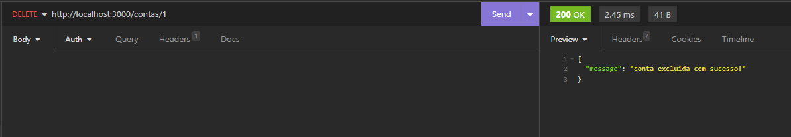

o quinto endpoint eh o de depositar, ele vai receber numeroConta e valor dentro do corpo da requisicao
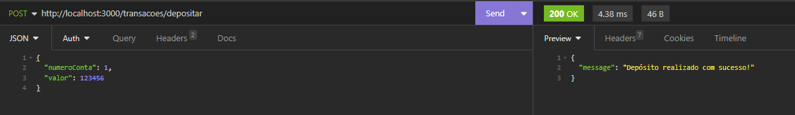

caso seja inserido um numero de conta que nao existe ele retorna um erro: 
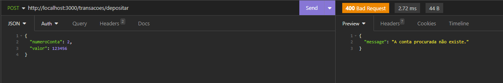

o sexto endpoint eh o de sacar. ele recebe no corpo da requisicao o numeroConta, valor e senha
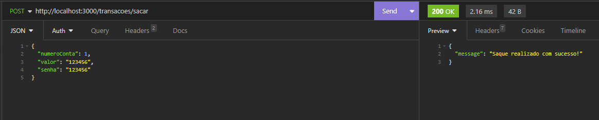 

e caso insira um numero de conta inexistente ele retorna um erro:

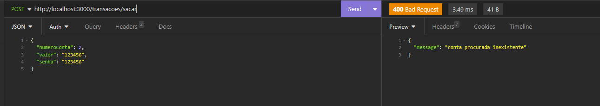

o setimo endpoint eh de transferir valores de uma conta pra outra. o endpoint recebe no corpo da requisicao a conta_origem, conta_destino, valor e senha.

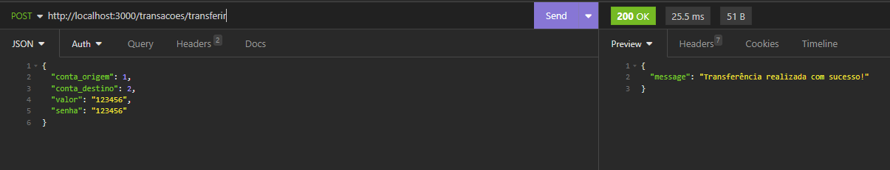

caso tente enviar um valor acima do valor que tem na conta ele retorna um erro: 
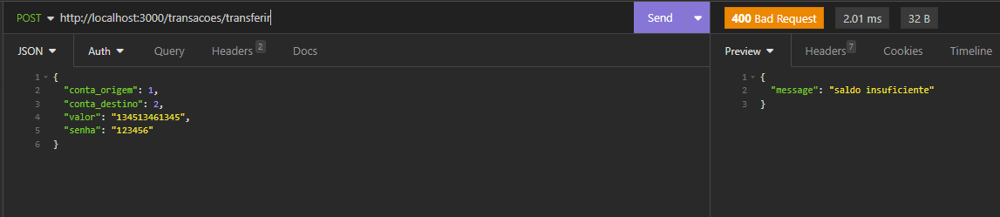

caso tente colocar um numero de conta de origem que nao existe ele retorna um erro:
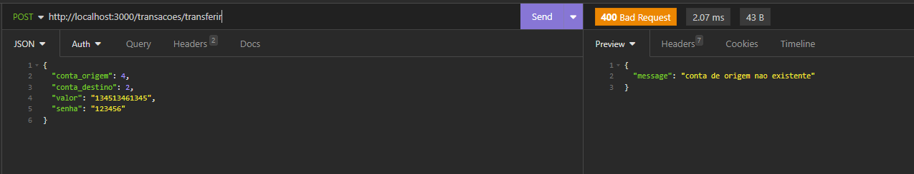
e conta de destino tambem:
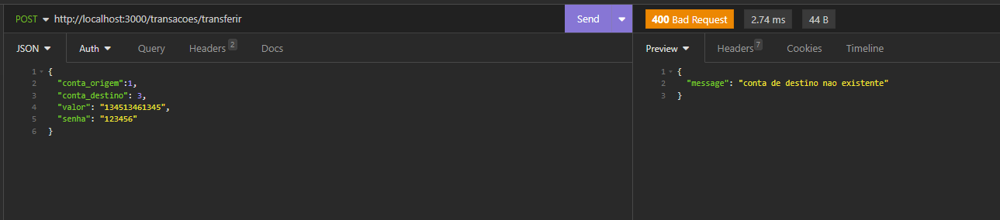

o oitavo endpoint eh pra mostrar o saldo em conta:
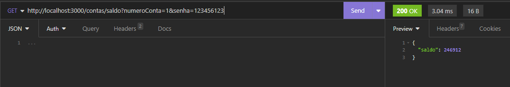
ele pede o numero da conta e a senha da conta como query params

e caso eu tente uma senha invalida ele da erro
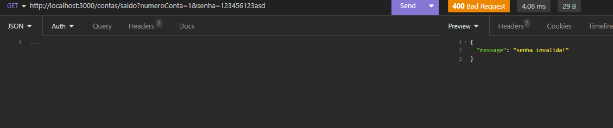